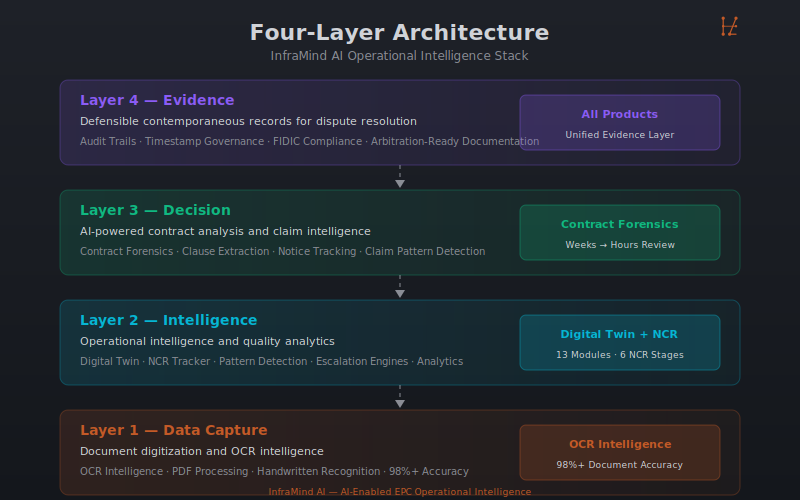

# InfraMind AI — Executive Capability Statement

**AI-Enabled EPC Operational Intelligence**

---

---

## Executive Summary

**InfraMind AI** delivers practitioner-built AI operational intelligence systems for EPC megaprojects. Founded by **Samanta Nayak** — a 20+ year EPC infrastructure veteran and ICC Arbitration Fact Witness — InfraMind AI encodes real-world contract administration expertise into deployed AI-augmented systems.

**Mission:** Eliminate the information lag that transforms manageable risks into costly disputes on infrastructure megaprojects.

---

## The Rarest Combination

| Dimension | Capability |
|-----------|------------|
| **Experience** | 20+ years EPC infrastructure |
| **Domain** | FIDIC contract administration, claims & dispute resolution |
| **Technical** | AI engineering, full-stack development |
| **Credibility** | ICC Arbitration Fact Witness |
| **Deployment** | Live on MAHSR T-3 (INR 3,142 Crore FIDIC Yellow Book) |

---

**Ready to explore how operational intelligence can reduce contractual exposure on your project?**

Schedule a consultation: [https://inframind-ai-website.vercel.app/contact](https://inframind-ai-website.vercel.app/contact)

---

## Product Portfolio

### Operational Intelligence Products

| Product | Category | Status | Key Metric |
|---------|----------|--------|------------|
| **MAHSR T-3 Digital Twin** | Operational Intelligence | Production | 75% MIS effort reduction |
| **NCR Tracker** | Quality Intelligence | Production | 40%+ faster closure |
| **Contract Forensics** | Contract Intelligence | Demonstrable | Weeks → Hours review |
| **OCR Intelligence** | Document Intelligence | Demonstrable | 98%+ accuracy |

---

## Four-Layer Architecture

| Layer | Function | Products |
|-------|----------|----------|
| **Layer 1: Data Capture** | Document digitization & OCR | OCR Intelligence |
| **Layer 2: Intelligence** | Operational intelligence & analytics | Digital Twin, NCR Tracker |
| **Layer 3: Decision** | AI-powered contract analysis | Contract Forensics |
| **Layer 4: Evidence** | Structured documentation aligned with contractual and evidentiary requirements | All Products |

---

## MAHSR T-3 Deployment

**Mumbai-Ahmedabad High-Speed Rail — T-3 Track Package**

| Metric | Value |
|--------|-------|
| Contract Value | INR 3,142 Crore |
| Contract Form | FIDIC Yellow Book |
| Scope | 115.877 km (Vadodara to Sabarmati) |
| Oversight | JICA / JICC |
| Employer | NHSRCL |
| Contractor | Larsen & Toubro Limited |

**Governance Structure:** JICA (Funding Agency) → NHSRCL (Employer) → JICC (Engineer / PMC) → L&T Limited (Contractor)

---

## Representative Project Experience

| Project | Role | Scope |
|---------|------|-------|
| **MAHSR T-3 Track Package** | Manager — Contracts & Claims, Larsen & Toubro Limited | FIDIC Yellow Book contract administration for 115.877 km of high-speed rail track construction under JICA/JICC oversight |
| **ICC Arbitration** | Fact Witness | Dispute resolution and expert testimony in international arbitration proceedings |
| **AI Product Deployment** | Founder, InfraMind AI | Operational deployment of Digital Twin and NCR Tracker on live EPC megaprojects |

---

## Services

### EPC Intelligence Consulting

| Service | Target Client | Duration |
|---------|---------------|----------|
| AI Strategy Consulting | EPC contractors seeking AI adoption | 60-90 min |
| Digital Twin Architecture | EPC contractors on linear infrastructure | 90 min |
| Contract Intelligence Design | Legal counsel and contracts managers | 60 min (NDA) |
| Expert Advisory | Legal counsel and expert witnesses | 30-60 min (NDA) |
| Planning, Scheduling & Programme Controls | EPC contractors and project controls teams | 60 min |
| Delay Analysis, EOT & Claims Support | Contract managers, legal counsel, project directors | 60 min (NDA) |

### Service Packages

| Package | Services | Target |
|---------|----------|--------|
| EPC Intelligence Starter | AI Strategy + Digital Twin Architecture | Mid-size EPC contractors |
| Megaproject Intelligence Suite | All consulting services | Large EPC contractors, JVs |
| Dispute Resolution Support | Expert Advisory + Contract Intelligence + Delay Analysis | Legal counsel, expert witnesses |
| Programme Controls Package | Planning & Scheduling + Delay Analysis & EOT | Project controls teams |

---

## AI Capability Matrix

| Technology | Application | Status |
|------------|-------------|--------|
| Large Language Models (LLM) | Contract clause extraction, report generation | Production |
| OCR with AI Enhancement | Document digitization, handwritten recognition | Production |
| Rule-Based Automation | FIDIC notice monitoring, NCR escalation | Production |
| Pattern Detection Analytics | Systemic quality analysis, claim patterns | Pilot |
| Prompt Engineering | Domain-calibrated FIDIC/EPC workflows | Production |

---

## Target Stakeholders

| Stakeholder | Value Proposition |
|-------------|-------------------|
| **EPC Contractors** | Operational intelligence, reduced contractual exposure |
| **PMCs** | Real-time project visibility, automated quality tracking |
| **Infrastructure Owners** | Structured records, dispute prevention |
| **Government Authorities** | Compliance dashboards, audit-ready documentation |
| **Rail Projects** | Chainage-referenced corridor intelligence |
| **Arbitration Support** | Prepared in a manner suitable for supporting dispute avoidance and dispute resolution processes; expert testimony |

---

## Credentials

- **20+ Years EPC Infrastructure Experience** — Manager — Contracts & Claims, Larsen & Toubro Limited
- **ICC Arbitration Fact Witness** — Dispute resolution and expert testimony
- **AI Generalist Certification** — Outskill — Applied AI for business
- **AIG Community Champion 2025** — AI community leadership

---

## Vision

> "To make operational intelligence the default state of EPC megaproject administration — eliminating the information lag that transforms manageable risks into costly disputes."

---

## Contact

**InfraMind AI**
AI-Enabled EPC Operational Intelligence

**Samanta Nayak**
Manager — Contracts & Claims | Infrastructure AI Architect

🌐 [https://inframind-ai-website.vercel.app](https://inframind-ai-website.vercel.app)
📧 [Contact via website](https://inframind-ai-website.vercel.app/contact)
💼 [LinkedIn](https://linkedin.com)

---

**Ready to discuss how operational intelligence can reduce contractual exposure on your project?**

[Schedule a consultation →](https://inframind-ai-website.vercel.app/contact)

---

*Document Version: 1.1 | Generated: June 2026*
*Blue IM Monogram Branding Applied*
